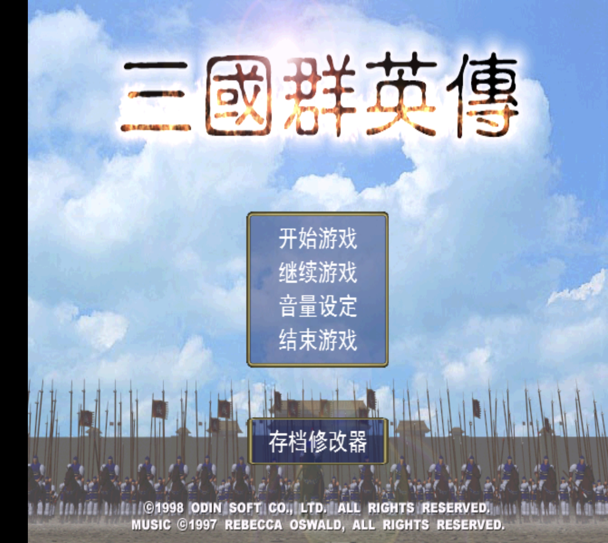
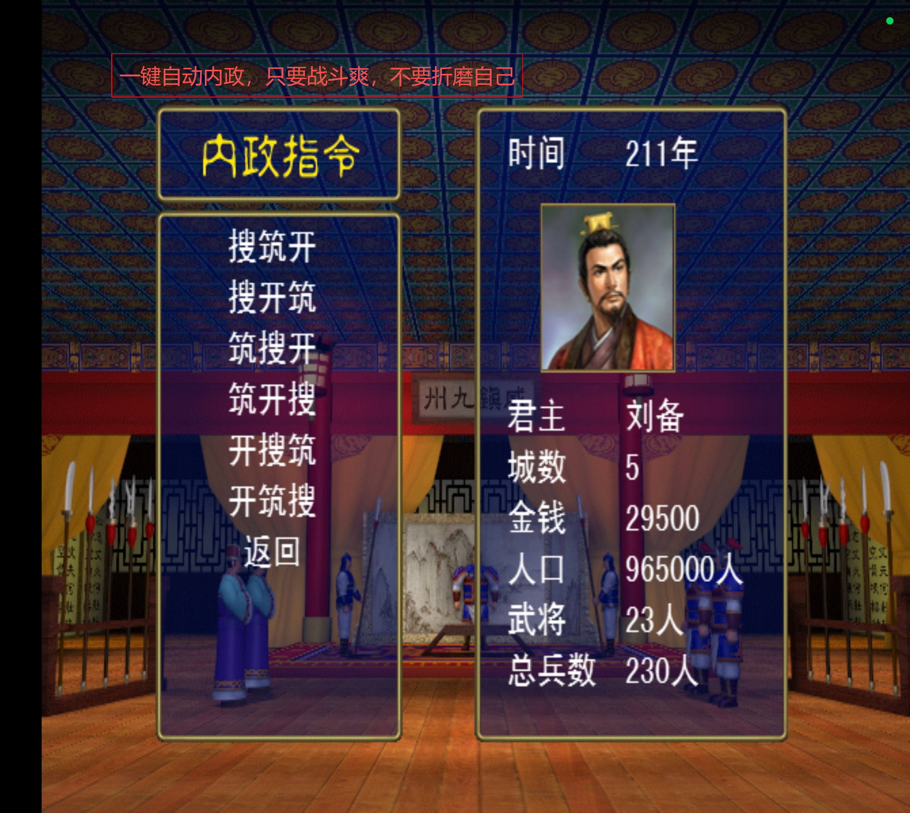
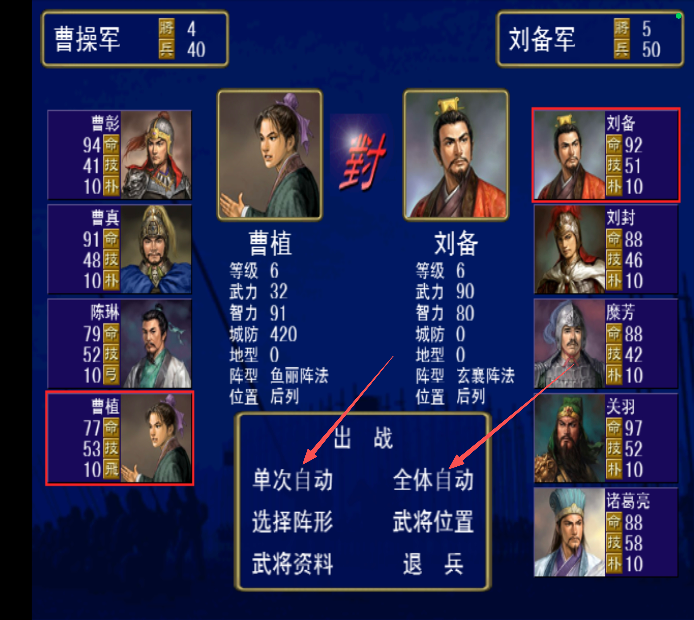
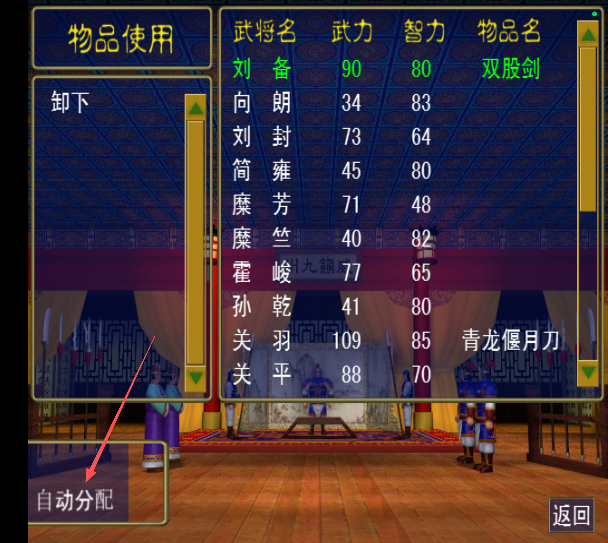
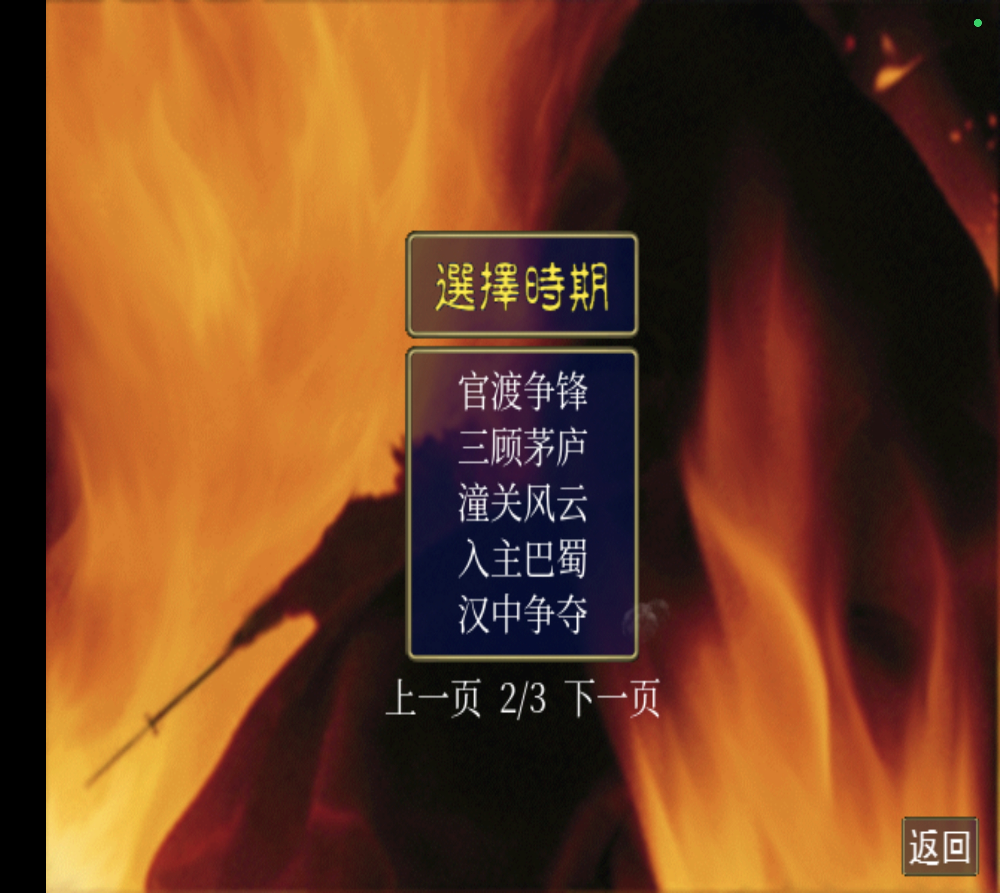

  

  <strong>三国群英传 AI 加强版</strong> 
  相比原版，增加三项自动化功能，并带来策略 AI、历史搜将与更多开局。

  

  <a href="https://github.com/SCUliujiacheng/sanguo-ai-enhanced/releases">全部版本</a> ·
  <a href="docs/FEATURES.md">功能与操作</a> ·
  <a href="docs/INSTALL.md">安装与存档</a> ·
  <a href="https://github.com/SCUliujiacheng/sanguo-ai-enhanced/issues">反馈建议</a>

Android APK · 当前版本 1.2.0 · 非官方同人加强版

## 看得见的加强，玩得到的省心

以下为玩家提供的游戏截图，保留功能标注。**点击图片可查看大图。**

<table>
<tr>
<td width="50%" valign="top">
<h3>01 · 自动内政</h3>

一键批量处理招降、搜索、筑城和开发。 自选任务优先顺序，减少重复指派。

内政 → 总内政 → 选择优先顺序

</td>
<td width="50%" valign="top">
<h3>02 · 自动战斗</h3>

单次结算当前对决，或连续处理整场交战。 把时间留给战略选择。

战前选将 → 单次自动 / 全体自动

</td>
</tr>
<tr>
<td width="50%" valign="top">
<h3>03 · 装备自动分配</h3>

统筹己方各城库存与武将现有装备。 按属性分配，安排兵种与阵法学习。

物品使用 → 自动分配 → 确认

</td>
<td width="50%" valign="top">
<h3>04 · 十四个时期</h3>

原有五期，加上七个历史与两个架空开局。 从官渡对峙，到单城突围。

新游戏 → 选择时期 → 上一页 / 下一页

</td>
</tr>
</table>

三项自动化是本加强版相对原版的既有扩展；**1.2.0 在这些功能基础上新增时期与历史搜将**。自动内政按次执行，自动战斗有正常战损，装备分配会重新安排现有装备。详见[功能与操作说明](docs/FEATURES.md)。

## 经营更省心，攻守更讲究

| 改进 | 战局中的变化 |
| --- | --- |
| **策略 AI** | 综合守将人数与战力组织进攻，考虑留守和援军，抵达敌城时再次判断胜算。 |
| **历史搜将** | 按年份、活动地区与当时阵营筛选；原属势力真正灭亡后，当地占领者也能招募。 |
| **经济修复** | 部队携款出城，出发城市同步扣款；实际携款不会超过余额，堵住反复刷钱的问题。 |

电脑的策略优化采用规则判断，没有额外发钱或直接提高武将属性。玩家与电脑共用历史搜索条件；已经归队或被俘的人才不会被强制改写归属，两个架空挑战保留自由搜索。

## 换一个时代，再争一次天下

| 年份 | 新增历史时期 | 这一局，从何处破局 |
| :---: | --- | --- |
| **200** | 官渡争锋 | 曹袁对峙，中原承压，徐州与江东伺机而动 |
| **207** | 三顾茅庐 | 刘备立足新野，有限资源如何分给经营与扩张 |
| **211** | 潼关风云 | 关西直面中原，汉中与益州寻找机会 |
| **214** | 入主巴蜀 | 刘备跨荆益分兵，入蜀与守荆两难兼顾 |
| **219** | 汉中争夺 | 北进汉中，同时稳住荆州边境 |
| **222** | 夷陵之战 | 蜀吴交锋，魏国从另一条战线施压 |
| **228** | 北伐中原 | 蜀出关陇、吴进江淮，魏国调度纵深守军 |

**两种架空挑战**

- **英雄集结**：九家各据五城，历代名将同台争雄。
- **孤城逆袭**：推荐刘备新野起步，在强敌环伺中寻找扩张路线。

原有五期与历史设定说明

原有时期保留：**黄巾之乱、讨伐董卓、群雄割据、赤壁之战、三国鼎立**。在新游戏的时期菜单中，用“上一页 / 下一页”切换。

历史开局基于原游戏的 48 城地图设计，部分地理与年内转投采用游戏化约定。搜将规则覆盖 255 名角色，史料依据、剧本推定与演义身份分别标注。

[查看剧本设计](scenarios/README.md) · [查看历史搜将规则](docs/RECRUITMENT.md)

## 三步开始

1. **下载安装包**：点击上方金色按钮，获取 `sanguo-ai-enhanced-v1.2.0.apk`；Source code ZIP / TAR 是仓库文件。
2. **安装或覆盖更新**：1.2.0 沿用上一“经济修复与 AI 优化”修改版的签名。先保护重要存档；来源 APK 签名不同，不能直接覆盖。[安装说明 →](docs/INSTALL.md)
3. **选择剧本与势力**：进入新游戏，选定时期；内政用“总内政”，配装用“自动分配”，迎战时可选择自动结算。

## 一起把这个版本做得更好

欢迎在 [Issues](https://github.com/SCUliujiacheng/sanguo-ai-enhanced/issues) 分享有意思的战局、难度建议和有出处的史料纠错。反馈问题时，附上**版本、手机型号、剧本势力和复现步骤**，会更容易定位。

| 想了解什么 | 从这里开始 |
| --- | --- |
| 功能怎么用、自动化处理到哪一步 | [功能与操作](docs/FEATURES.md) |
| 想调整开局与人才规则 | [剧本配置](scenarios/README.md) · [生成工具](scripts/README.md) |
| 这个版本改了什么 | [更新记录](CHANGELOG.md) |
| 测过哪些内容 | [1.2.0 验证报告](docs/VALIDATION-v1.2.0.md) |

验证范围与项目说明

1.2.0 最终程序集通过 **29 项经济 / AI 回归、44 项时期 / 搜将检查**；另有 **18 项数据测试**，APK 签名与逐项内容校验通过。本轮尚未完成 Android 安装与实玩验收；自动化代码核查不等于所有设备的运行验证。

本仓库公开版本说明、剧本配置、生成工具与新增辅助类。安装包在 Releases 提供，仓库不是完整 APK 的一键编译工程。

本项目是非官方同人修改版，与原游戏权利方无隶属或背书关系。原游戏名称、代码、美术、音乐等权利归各自权利人所有，本仓库不对这些原有内容授予开源许可。权利方可通过 Issues 联系维护者。

---

少一点重复操作，多一点攻守之间的选择。

